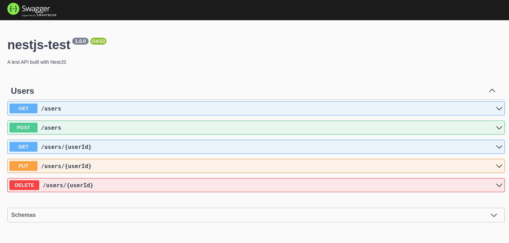

# NestJS Test
API made with Typescript, PostgreSQL to study NestJS.

Developed with [Docker](https://www.docker.com) (and Docker-Compose)


## Table of Contents
  - [Requirements](#requirements)
  - [How to run](#how-to-run)
  - [Commands](#commands)
    - [Install dependencies](#install-dependencies)
    - [Run the API](#run-the-api)
    - [Migrations](#migrations)
    - [Run commands](#run-commands)
    - [Tests](#tests)
  - [Docs](#docs)
    - [Rest API](#rest-api)
      - [Routes](#routes)
    - [Entities Schema](#entities-schema)
      - [Entities](#entities)
  - [Authors](#authors)

## Requirements
- Docker (and docker-compose)
- Yarn (Optional)

## How to run
- Create `.env` file using `.env.example` as base
- Install dependencies ([check commands session](#commands))
- Run the API ([check commands session](#commands))
- Run the migrations ([check commands session](#commands))

## Commands
### Install dependencies
```bash
# Install dependencies
docker-compose run --rm api yarn
```

### Run the API
```bash
# Start the api
docker-compose up
# Then open http://localhost:4000
```

### Migrations
- Run migrations
```bash
# API must be running
yarn docker:migration:run
# or with NPM: npm run docker:migration:run
# or with docker-compose: docker-compose -f docker-compose-cli.yml run --rm cli yarn typeorm migration:run
```

- Generate new migration
```bash
# API must be running
yarn docker:migration:generate MigrationName
# or with NPM: npm run docker:migration:generate MigrationName
# or with docker-compose: docker-compose -f docker-compose-cli.yml run --rm cli yarn typeorm migration:generate -- -n MigrationName
```

## Run commands
```bash
docker-compose run --rm api ...
```

## Tests
To run all tests: 
```bash
yarn docker:test
# or with NPM: npm run docker:test
# or with docker-compose: docker-compose -p nestjs-test -f docker-compose-test.yml run --rm test
```

To run a specific test: 
```bash
yarn docker:test yarn test __tests__/folder_you_wanna_test/...
# or with NPM: npm run docker:test yarn test __tests__/folder_you_wanna_test/...
# or with docker-compose: docker-compose -p nestjs-test -f docker-compose-test.yml run --rm test
```

## Docs
### Rest API
- Run the API
- Then visit `/docs`



## Authors
- Matheus Ribeiro